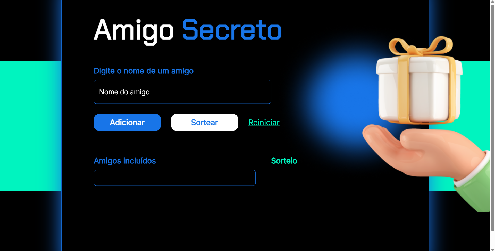

# 🎁 Secret Friend

A Secret Friend (Secret Santa) web application built with HTML, CSS, and JavaScript as part of a programming challenge from Alura.

The application allows users to add participants, prevent duplicate names, randomly shuffle the list, and generate a Secret Friend draw where each participant is assigned to another person.

## 📋 About the Project

The application was developed to practice working with arrays and JavaScript logic through a practical and interactive project.

Users can enter participant names and add them to a list. Once enough participants have been added, the application randomly shuffles the array and generates the Secret Friend assignments.

The project also includes validation to prevent duplicate names and requires at least four participants before performing the draw.

## ✨ Features

👥 Add participants to the list
🚫 Prevent duplicate names
🧹 Ignore empty input
🔀 Randomly shuffle the participants
🎁 Generate Secret Friend assignments
⚠️ Require at least four participants
🔄 Reset the participant list and draw
🖥️ Dynamically update the page using JavaScript

## 🛠 Technologies

- HTML5
- CSS3
- JavaScript (Vanilla JS)

## 🧠 What I Practiced
- Creating and manipulating arrays
- Adding elements with push()
- Checking for existing elements with includes()
- Converting arrays into strings with join()
- Manipulating the DOM with getElementById()
- Reading and updating HTML content
- Creating and calling functions
- Using conditional statements
- Using for loops to iterate through arrays
- Generating random values with Math.random()
- Using Math.floor() for random indexes
- Using destructuring assignment to swap array elements
- Validating user input
- Managing application state with JavaScript

## 🔑 Key Concepts
One of the main concepts practiced in this project was storing participants in an array:

let amigos = [];

When a participant is added, the name is inserted into the array:

amigos.push(amigo);

Before adding the name, the application checks whether the participant is already in the list:

if (amigos.includes(amigo)) {
    alert("Choose a name that is not already on the list");
    return;
}

The array is then displayed on the page using join():

document.getElementById("lista-amigos").innerHTML = amigos.join(", ");

🔀 Array Shuffling

The application uses a random shuffling algorithm to change the order of the participants before generating the draw.

The implementation swaps elements within the array using random indexes and destructuring assignment:

[lista[indice - 1], lista[indiceAleatorio]] =
    [lista[indiceAleatorio], lista[indice - 1]];

After the array is shuffled, each participant is assigned to the next participant in the list, with the last participant being assigned to the first one.

## 🎯 Project Objective

The main objective of this challenge was to practice arrays, functions, conditional logic, loops, DOM manipulation, and randomization by building a practical application.

This project was also an opportunity to work more independently with JavaScript and develop problem-solving skills while implementing the application logic.

## 🔗 Live Project

https://danielgranato.github.io/secret-friend/

## 🎓 Context

This project was developed as part of a programming challenge from Alura, a technology education platform.

## 👨‍💻 Author

Daniel Granato

GitHub:
https://github.com/DanielGranato

